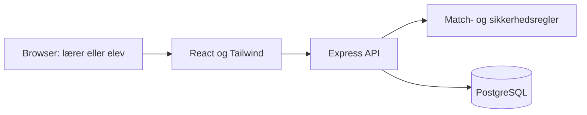

# Arkitektur og data

## Høj abstraktion

Docker Compose starter en app-container og PostgreSQL. Express leverer både API
og Reacts produktionsbuild. PostgreSQL har vedvarende volume. Serveren vurderer
reglerne; klienten viser valg og forklaringer, men kan ikke overstyre sikkerhed.

## Tredje normalform

Domænet adskiller rideskoler, profiler, elevforudsætninger, heste, hold og lektioner.
Medlemskaber, behov, aktivitetsmuligheder og ønsker er relationstabeller. Elevnavn,
hestenavn og skolens navn kopieres ikke ind i hver tildeling. Fordelingsstatus hentes
fra fordelingen; den opbevares ikke som afledt elevstatus. Audit-snapshots er
historiske dokumenter og erstatter ikke normaliserede domænerelationer.

Det konkrete skema ligger i [schema.sql](../server/db/schema.sql).
Skole-id indgår ved rodentiteter; databasekontroller og API afgrænser relationerne,
så en elev, hest eller lærer ikke tilknyttes en anden skoles hold.

## Videreudvikling

En rigtig identitetsudbyder kan kobles til eksisterende profil-id'er og skole-id'er.
Udvidelser som venteliste, betaling og faktisk fremmøde får egne entiteter.
Månedsafslutning skal definere og arkivere faktiske månedsresultater; den demonstrerede
godkendelse af én lektion må ikke ændre tidligere måneders ventetid.
Casebilagenes navne og værdier ligger i seed-data, ikke som globale regler i UI.

## Datagrundlag

Hestens dokumenterede egenskaber har kilde. Ukendte faglige grænser er ikke
fortolket som ubegrænset kapacitet: demonstrationen bruger mærkede eksempelværdier.
Regler om højst tre hold dagligt, mindst én fridag og højst én springning ugentligt
fastholdes. Hestens individuelle hensyn kan skærpe reglerne.

## Profil og billedreference

Elevhensyn gemmes i student_needs og deles på tværs af elevens hold. Eleven kan
ændre egne valg; lærerens læsemodel henter samme data. Hesternes billedreference
og oprindelsestype ligger på hesten, så eget skolefoto senere kan erstatte mockuppen.

Det gældende scope beskrives i [Specify](../specs/001-digital-holdadministration/spec.md).
Arbejdsgangen og senere udvidelser findes i [proces](process.md); alle aktive krav
spores til implementation/opgaver i [sporbarhed](traceability.md).
